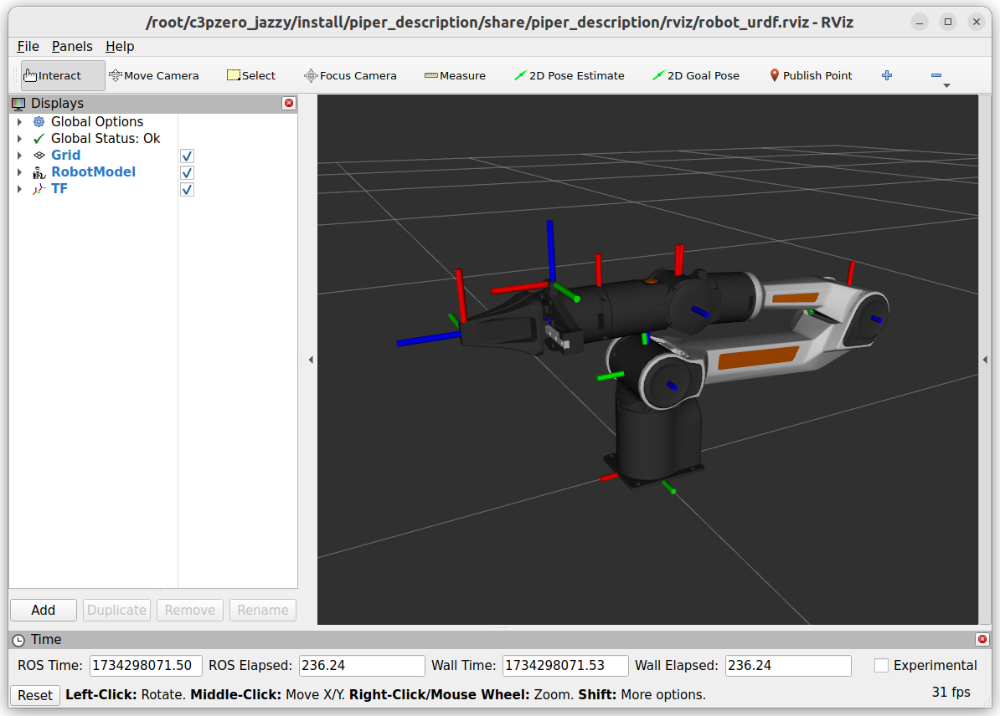

[](https://github.com/MarqRazz/piper_ros2/actions/workflows/format.yaml.yaml)

# Piper ROS2

The Piper ROS2 repository contains multiple packages for working with the Piper robot arm.
- `piper_description` package contains URDF Xacro and configuration files that describe the manipulator.
- `piper_bringup` package contains launch files for bringing up simulated environments of the manipulator.

## Visualizing URDF

```
ros2 launch piper_description view_urdf.launch.xml
```




## Simulating with Mock Hardware

```
ros2 launch piper_bringup piper.launch.xml mock_hardware:=true rviz:=true
```

## Simulating with Gazebo

```
ros2 launch piper_bringup gazebo_piper.launch.py headless:=false rviz:=true
```

## MoveIt Example Configuration

To try out the included MoveIt configuration first start the robot with Mock Hardware or Gazebo.

If simulating with Mock Hardware no additional arguments are needed to start Moveit.
```
ros2 launch piper_moveit_config demo.launch.xml
```

If simulating with Gazebo we need to tell MoveIt to use the clock published by the simulator:
```
ros2 launch piper_moveit_config demo.launch.xml use_sim_time:=true
```

## Testing Available ROS2 Controllers

You can send manual commands to the running controllers with the following examples:
- RQT Joint Trajectory Controller
>(`sudo apt install ros-$ROS_DISTRO-rqt-joint-trajectory-controller`)
```bash
ros2 run rqt_joint_trajectory_controller rqt_joint_trajectory_controller
```

- To send commands to the `joint_trajectory_controller`'s topic interface:
```bash
ros2 topic pub /joint_trajectory_controller/joint_trajectory trajectory_msgs/JointTrajectory "{
  joint_names: [joint_1, joint_2, joint_3, joint_4, joint_5, joint_6],
  points: [
    { positions: [0.0, 0.85, -0.75, 0.0, 0.5, 0.0], time_from_start: { sec: 2 } },
  ]
}" -1
```

- To send an action goal to the `gripper_controller`:
```bash
ros2 action send_goal /gripper_controller/gripper_cmd control_msgs/action/ParallelGripperCommand "{command: {name: [gripper_joint], position: [0.03]}}"
```

## Git LFS

This repo uses **[git-lfs](https://git-lfs.github.com)** to store the mesh files in the `piper_description` package. You can install and activate with:

```bash
sudo apt install git-lfs
git lfs install
```

If you have cloned this package without `git-lfs` pre-installed you can run `git lfs pull` to pull down the assets.
